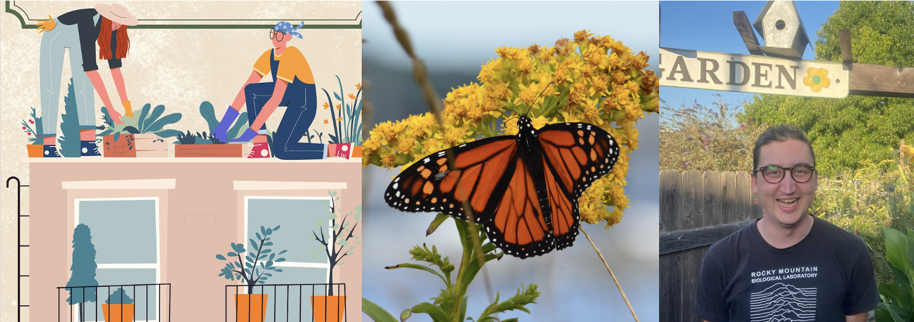

\

```{r echo=FALSE, out.width = '100%'}

```


\


#### I am an ecologist interested in understanding how organisms and ecosystems persist in human-altered landscapes, and in measuring how human behaviors collectively produce emergent costs and benefits for these organisms and ecosystems.

\
My research focuses on (1) the drivers of pollinator gardening, especially social contagion, (2) the ecology of insects in urban settings, including monarch butterflies and solitary bees, (3) approaches to improving conservation outcomes on private lands like gardens and farms, and (4) understanding how feedbacks between human actions and sea level rise act to improve or worsen environmental outcomes for coastal wetlands (my current postdoc).

Click the 'Research' tab for a brief summary of these lines of work.

I take a quantitative, interdisciplinary approach, drawing on tools from population ecology, landscape ecology, environmental social science, and others in order to understand how individually small management actions collectively produce emergent outcomes for organisms and landscapes at larger scales.

\

Following my PhD at Tufts University on socially contagious gardening (Sept 2018 - Sept 2024), I was a postdoctoral researcher at University of California, Davis (Oct 2024 - May 2025), both in the [Crone Lab](https://cronelab.faculty.ucdavis.edu/who-we-are/) (Department of Evolution and Ecology). As a postdoc, I worked on US Fish and Wildlife-funded experimental restoration for monarch butterflies along California's coast range. 

My current position (June 2025 - May 2026) is as a postdoc at Virginia Tech (remote, based in Reno, NV), where I work with Drs. [Ashley Dayer](https://dayer.fishwild.vt.edu/dayer-2//) and [Elizabeth Hunter](https://hunterlab.weebly.com/) as part of a NASA-funded project to understand socio-ecological responses to sea level rise along the Atlantic Coast.  

My CV can be downloaded [here](https://drive.google.com/file/d/1tS-dopNDASnJzRlkYdwzm7V-nxTVAf-U/view?usp=sharing).
