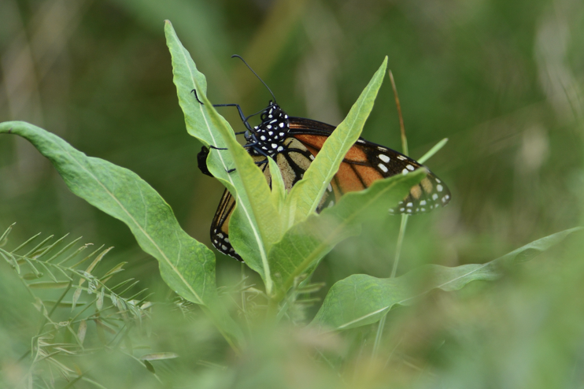

\

I have a variety of interests across ecology, conservation, geography, urban planning, and others. My research is mostly focused along three lines of work.

\

### 1. The drivers of pollinator gardening, especially social contagion

```{r echo=FALSE, fig.cap="Front yard flower gardens in greater Boston (photos: Google Street View)", out.width = '40%'}
knitr::include_graphics("Screenshot 2024-10-18 at 2.49.47.PM.png")
```


Urban habitat can be valuable for pollinators because it provides diverse floral resources; however, current yard landscaping norms are centered around turfgrass lawns, which are poor pollinator habitat. Effective conservation in this coupled socio-ecological system requires many people to change their current landscaping beahviors. One compelling possible contributor to this kind of behavior change is social contagion, which describes 'contagious' behaviors in which individuals act similarly to those with whom they interact the most.

We use large scale maps of front yard flower gardening to understand drivers and constraints to pollinator habitat creation, with a particular focus on the possible role of social contagion in spreading gardening practices between nearby neighbors.

*Relevant publications/manuscripts:*

Murphy A.M. & Crone E.E. Pollinator gardening is constrained by income but not lot size in urban front yards. In revision at Landscape & Urban Planning.

Others forthcoming.

\

### 2. The ecology of insects in urban settings, including monarch butterflies and solitary bees


```{r echo=FALSE, fig.cap="Ovipositing monarch butterfly (photo: Rachael Bonoan)", out.width = '40%'}

```


Urban landscapes are sometimes described as 'novel ecosystems' because they are so heavily human-modified. Yet a surprising diversity of insects nonetheless live in cities, particularly in pollinator gardens and other diverse garden habitats. In this line of research, I explore how these habitats function using population ecology to study habitat use, demography, movement, and others. We use butterflies and solitary bees as systems to explore these questions, in the context of basic ecological theories.

*Relevant publications/manuscripts*:

Dooley K., Murphy A.M., Crone E.E. Landscape context affects both capture probability and abundance of solitary bees in cities. In prep for submission to Ecological Applications.

Murphy A.M. & Crone E.E. Resource density affects host use by monarch butterflies in an urban landscape. In prep for submission to Biological Conservation.

\

### 3. Approaches to making pollinator gardens more effective conservation measures

```{r echo=FALSE, fig.cap="Research and outreach garden at Tufts University (photo: Rachael Bonoan/Billy Dunne)", out.width = '40%'}
knitr::include_graphics("Screenshot 2024-10-18 at 3.30.56.png")
```


Pollinator gardens have high potential for improving habitat quality for pollinators and other insects in residential areas. However, conservation in these residential contexts is different from traditional natural areas conservation in that the land is owned by a diverse set of independent landowners. Additionally, the pollinator gardening movement has developed as the result of a broad-based, diffuse collaboration between ecologists and laypeople, leading to unique challenges and opportunities for conservation and outreach. In this work, I advance a framework for how to maximize the utility of pollinator gardening for researchers, pollinators, and the public.

*Relevant publications/manuscripts*:

Dorian N., Murphy A.M., Iler A., CaraDonna P. Setting goals for pollinator gardens. In revision at Conservation Biology.

Murphy A.M. & 11 others. Defining the pollinator garden: is conceptual flexibility a bug or a feature? In prep for submission to Ecology Letters.

Murphy A.M. & Crone E.E. 2021. Pollinator gardens: landscaping for biodiversity in the 21st century. CREATE Solutions for a Changing World 1. Tufts University. [link](https://massbutterflies.org/downloads/CREATE_Pollinators_Murphy_Crone.pdf)

